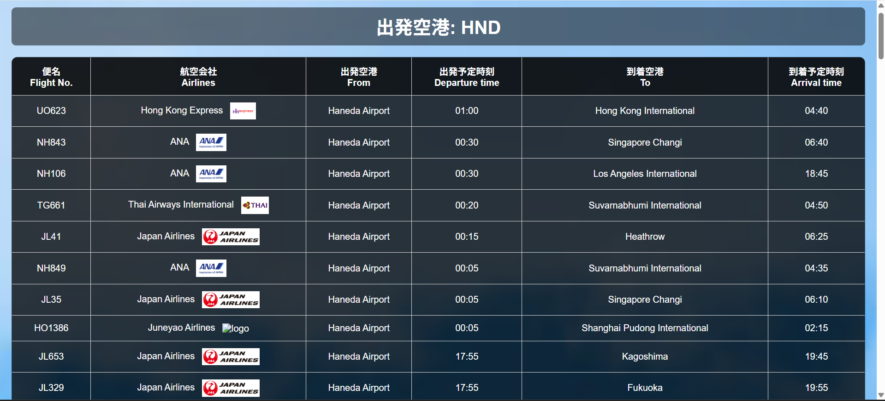

# Webフライト時刻表アプリ ✈️

Spring Boot + Thymeleaf を使用して作成した、国内空港のフライト時刻表検索アプリです。  
選択した空港の出発便一覧を取得・表示できます。



--------

## 概要
- 日本国内主要空港の **出発便時刻表** を取得・表示
- 出発空港を選択して検索（羽田・成田・関空・伊丹など）
- 便名、航空会社名、出発・到着空港名、予定時刻の表示
- 航空会社ごとのロゴ画像を表示 (例: JAL, ANA, Peach)

## 🛠️ 技術スタック
- **バックエンド**
  - Java 24 (Java 17+)
  - Spring Boot 3.x
  - RestTemplate (外部API呼び出し)
- **フロントエンド**
  - Thymeleaf
  - HTML / CSS
- **外部API**
  - [AviationStack API](https://aviationstack.com/) を使用

## 🚀 実行方法
### 1. リポジトリをクローン
```bash
git clone https://github.com/motomasMINO/WebFlightApp.git
cd WebFlightApp
```

### 2. 🌐 APIキーを設定
`FlightApiService.java` 内の API_KEY を [AviationStack](https://aviationstack.com/)から取得したキーに書き換えます。
```Java
private final String API_KEY = "取得したAPIキー";
```

### 3. アプリを起動
```bash
mvnw spring-boot:run
```

### 4. ブラウザでアクセス
```arduino
http://localhost:8080
```

## 📜 ライセンス
このプロジェクトはMIT Licenseのもとで公開されています。
  
実運用の際は API 利用規約を遵守してください。

## 📧 お問い合わせ
  - GitHub: motomasMINO
  - Email: yu120615@gmail.com

    バグ報告や改善点・機能追加の提案はPull RequestまたはIssueで受け付けています!
